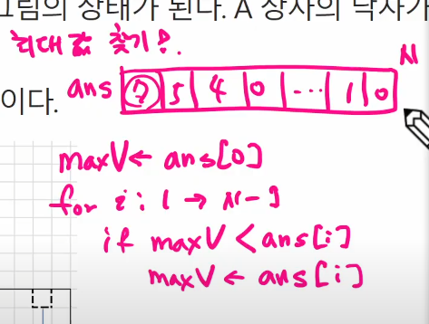

# 알고리즘

## <mark>** 빅오 표기법**</mark>

알고리즘의 시간복잡도(시간효율성)와 공간복잡도(메모리 효율성)를 나타냄

O(3n+2) = O(n)

O(4) = O(1)

상수항무시 , 영향력 없는 항은 무시

최악의 경우를 따짐

n개의 데이터를 입력받아 저장한 후 각 데이터에 1씩 증사시킨후 각 데이터를 출력하는

알고리즘의 시간 복잡도는 ? O(n)

1. <mark>O(1) </mark>: 스택에서 Push, Pop
   
   입력값(N)이 증가해도 실행시간은 동일한 알고리즘

2. <mark>O(log n)</mark> : 이진트리
   
   연산이 한 번 실행될 때 마다 데이터의 크기가 절반 감소하는 알고리즘 (log의 지수는 항상 2)

3. <mark>O(n) </mark>:
   
   입력값(N)이 증가함에 따라 실행시간도 선형적으로 증가하는 알고리즘
   
    for 문

4. <mark>O(n log n) </mark>: 퀵 정렬(quick sort), 병합정렬(merge sort), 힙 정렬(heap Sort)

5. <mark>O():</mark> 이중 for 문, 삽입정렬(insertion sort), 거품정렬(bubble sort), 선택정렬(selection sort)

6. <mark>O() :</mark> 피보나치 수열

## 배열이란 무엇인가?

배열은 <연속된 메모리 공간에 순차적으로 저장된 데이터 모음>

실제 메모리상에서도 물리적으로 연속돼있다. ***같은 타입의 데이터* **나열

** [1차원 배열 선언]**

 Arr = list()

Arr = []

Arr = [1,2,3]

인덱스로 접근 가능  Arr[idx]=20 

### 배열의 특징

- 추가적으로 소모되는 메모리 양(=overhead)가 거의 없다
- Cache hit rate가 높다.
  - cache hit ratio: 적중률 = (캐시히트 횟수)/(전체 참조횟수)
  - cache hit: 참조하려는 데이터가 캐시에 존재할 떄 캐시 히트
  - cache miss: 참조하려는 데이터가 캐시에 존재하지 않을 때 캐시미스

캐시가 필요한 이유 :  

대부분 프로그램은 한번 사용한 데이터를 다시 사용할 가능성이 높고, 그 주변의 데이터도 곧 사용할 가능성이 높은 <u>데이터 지역성</u>을 가지고 있다. <u>데이터 지역성을 활용하여 메인 메모리에 있는 데이터를 캐시 메모리에 불러와 두고, CPU가 필요한 데이터를 캐시에서 먼저 찾도록</u> 하면 시스템 성능을 향상시킬 수 있다.

## 배열활용 : gravity

# @정렬

[[자료구조] 기본 정렬 알고리즘 총 정리 :: For a better world](https://roytravel.tistory.com/328)

## 버블정렬

<u>서로 인접해 있는 요소 간의 대소 비교를 통해 정렬</u>한다. 

단순한 만큼 <u>비효율적</u>이다.

시간복잡도 ) 최고,평균,최악: 

공간복잡도) :
